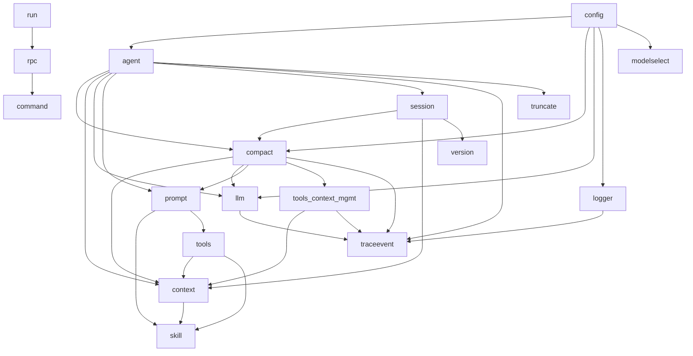

# Package Dependency Graph

> Auto-generated from `go list ./pkg/...` on the `refactor` branch.
> 18 internal packages total.

## Summary

| Metric | Value |
|--------|-------|
| Total packages | 18 |
| Leaf packages (no internal deps) | 6 |
| Packages with ≥3 internal deps | 5 |
| Circular dependencies | **0** |

## Dependency Table

| Package | Internal Dependencies | Count |
|---------|----------------------|-------|
| `pkg/agent` | `compact`, `context`, `llm`, `prompt`, `session`, `traceevent`, `truncate` | 7 |
| `pkg/compact` | `context`, `llm`, `prompt`, `tools/context_mgmt`, `traceevent` | 5 |
| `pkg/config` | `agent`, `compact`, `llm`, `logger`, `modelselect` | 5 |
| `pkg/session` | `compact`, `context`, `version` | 3 |
| `pkg/tools` | `context`, `skill` | 2 |
| `pkg/prompt` | `skill`, `tools` | 2 |
| `pkg/tools/context_mgmt` | `context`, `traceevent` | 2 |
| `pkg/context` | `skill` | 1 |
| `pkg/llm` | `traceevent` | 1 |
| `pkg/logger` | `traceevent` | 1 |
| `pkg/rpc` | `command` | 1 |
| `pkg/run` | `rpc` | 1 |
| `pkg/command` | *(none)* | 0 |
| `pkg/modelselect` | *(none)* | 0 |
| `pkg/skill` | *(none)* | 0 |
| `pkg/traceevent` | *(none)* | 0 |
| `pkg/truncate` | *(none)* | 0 |
| `pkg/version` | *(none)* | 0 |

## Most Imported Packages (In-Degree)

These packages are depended on by the most other internal packages:

| Package | Imported By | Count |
|---------|------------|-------|
| `pkg/context` | `agent`, `compact`, `session`, `tools`, `tools/context_mgmt` | 5 |
| `pkg/traceevent` | `agent`, `compact`, `llm`, `logger`, `tools/context_mgmt` | 5 |
| `pkg/llm` | `agent`, `compact`, `config` | 3 |
| `pkg/compact` | `agent`, `config`, `session` | 3 |
| `pkg/skill` | `context`, `prompt`, `tools` | 3 |

## Focus: `pkg/agent/` Dependencies

`pkg/agent` is the highest-dependency package with **7 internal imports**, making it the most tightly coupled package in the codebase:

```
pkg/agent
├── pkg/compact        (conversation compaction)
├── pkg/context        (context/file management)
├── pkg/llm            (LLM API client)
├── pkg/prompt         (prompt template building)
├── pkg/session        (session persistence)
├── pkg/traceevent     (tracing/events)
└── pkg/truncate       (output truncation)
```

This is a key refactoring target: `pkg/agent` acts as an orchestrator that directly imports nearly every subsystem. Reducing these dependencies (e.g., via interfaces, dependency injection, or facade packages) would improve testability and reduce coupling.

## Dependency Layers (Bottom-Up)

Packages grouped by dependency depth. Packages in the same row only depend on packages in rows above them.

```
Layer 0 (leaves):     command, modelselect, skill, traceevent, truncate, version
Layer 1:              context, logger
Layer 2:              llm, tools/context_mgmt
Layer 3:              compact, prompt, tools
Layer 4:              session
Layer 5:              agent, config, rpc
Layer 6:              run
```

### Notes

- **Layer 0** packages have zero internal dependencies — they are the foundation.
- **`pkg/agent`** sits at Layer 5, importing from 5 different layers (0–4).
- **`pkg/config`** also imports 5 internal packages but notably imports `pkg/agent` itself, forming the application wiring layer.
- **`pkg/run`** is the top-level entry point, depending only on `pkg/rpc`.

## Circular Dependency Analysis

**No circular dependencies detected.** The import graph forms a clean DAG (directed acyclic graph). This is a healthy sign — all package relationships flow in one direction without cycles.

## Visual Graph (Mermaid)

